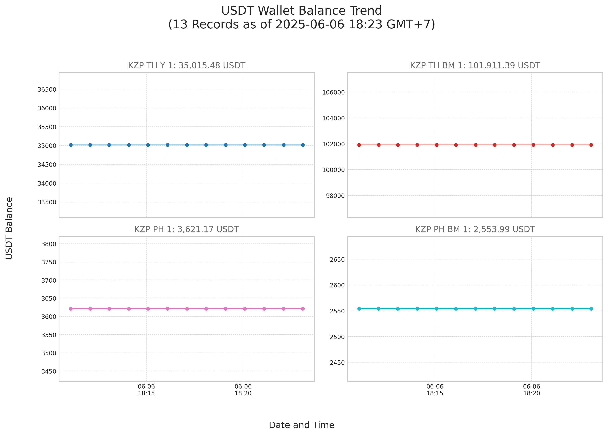

# USDT Wallet Balance Slack Bot

A Python bot that automatically monitors multiple USDT TRC20 wallet balances using the Tronscan API, maintains historical records in CSV format, generates multi-panel trend visualizations, and delivers comprehensive reports to Slack channels. Built with precision decimal handling and robust error management for reliable automated execution.

## Features

- **Multi-wallet USDT TRC20 tracking**: Monitor balances across multiple configured wallets
- **Precision decimal handling**: Uses Python's Decimal class for accurate cryptocurrency calculations
- **Historical CSV logging**: Automatic balance history with GMT+7 timestamps in ISO 8601 format
- **Multi-panel trend charts**: Individual subplot visualizations for each wallet using matplotlib
- **Slack integration**: Automated text summaries and chart image uploads via Slack SDK
- **Robust error handling**: Comprehensive exception handling for API calls, file operations, and Slack communication
- **Timezone consistency**: All timestamps standardized to GMT+7 across the entire system
- **Modular architecture**: Clean separation of concerns across dedicated modules

## How It Works

The bot executes a sequential workflow:

1. **Balance Fetching**: Queries Tronscan API for current USDT TRC20 balances using the official contract address
2. **Precision Processing**: Handles all monetary calculations using Python's Decimal class for accuracy
3. **CSV Logging**: Appends timestamped balance data with GMT+7 timezone consistency
4. **Chart Generation**: Creates multi-panel visualizations showing individual wallet trends
5. **Slack Reporting**: Sends formatted summaries and uploads chart images to designated channels

## Prerequisites

- Python 3.8 or higher
- pip package installer
- Git for repository cloning
- Slack workspace with configured bot application

## Slack App Setup (For IT Team)

### Step 1: Create Slack App
1. Go to https://api.slack.com/apps
2. Click **"Create New App"**
3. Select **"From scratch"**
4. Enter App Name: `USDT Wallet Monitor` (or your preferred name)
5. Select your workspace from the dropdown
6. Click **"Create App"**

### Step 2: Configure OAuth Scopes
1. In the left sidebar, click **"OAuth & Permissions"**
2. Scroll down to **"Scopes"** section
3. Under **"Bot Token Scopes"**, click **"Add an OAuth Scope"**
4. Add these two required scopes:
   - `chat:write` - Send messages to channels
   - `files:write` - Upload chart images

### Step 3: Install App to Workspace
1. Still on the **"OAuth & Permissions"** page
2. Scroll to the top and click **"Install to Workspace"**
3. Review permissions and click **"Allow"**
4. Copy the **"Bot User OAuth Token"** (starts with `xoxb-`)
   - **Important**: Save this token securely - you'll need it for configuration

### Step 4: Get Channel ID
1. Open Slack desktop/web app
2. Navigate to the channel where you want bot reports
3. Right-click the channel name and select **"View channel details"**
4. Scroll down to find the **Channel ID** (format: C1234567890)
5. Copy this Channel ID - you'll need it for configuration

### Step 5: Add Bot to Channel
1. In the target Slack channel, type: `@USDT Wallet Monitor` (or your app name)
2. Slack will prompt to add the bot to the channel
3. Click **"Invite to Channel"**

### Required Information for Bot Configuration
After completing the Slack setup, provide these to the bot administrator:
- **Bot User OAuth Token**: `xoxb-...` (from Step 3)
- **Channel ID**: `C...` (from Step 4)

## Installation

1. **Clone the repository**
   ```bash
   git clone https://github.com/sonnguyenkzg/crypto-slack-bot.git
   cd crypto-slack-bot
   ```

2. **Create Python virtual environment**
   ```bash
   python3 -m venv .venv
   source .venv/bin/activate
   ```

3. **Install dependencies**
   ```bash
   pip install -r requirements.txt
   ```

## Configuration

### Environment Variables

Create a `.env` file in the project root:
```env
SLACK_BOT_TOKEN="xoxb-YOUR_SLACK_BOT_TOKEN_HERE"
SLACK_CHANNEL_ID="YOUR_SLACK_CHANNEL_ID_HERE"
```

### Wallet Configuration

Edit `bot/config.py` to modify the `WALLETS` dictionary:
```python
WALLETS = {
    "Wallet Name 1": "TRC20_WALLET_ADDRESS_1",
    "Wallet Name 2": "TRC20_WALLET_ADDRESS_2",
    # Add or modify wallet entries as needed
}
```

### Configuration Options

Key settings in `bot/config.py`:

- **WALLETS**: Dictionary mapping display names to TRC20 wallet addresses
- **NUM_RECORDS_TO_PLOT**: Number of historical data points shown in charts (default: 13)
- **SLACK_BOT_TOKEN**: Loaded from environment variables via python-dotenv
- **SLACK_CHANNEL_ID**: Target channel for bot reports

## Usage

### Manual Execution

Test the bot manually:

```bash
# Ensure virtual environment is active
source .venv/bin/activate
python main.py
```

The bot will:
- Fetch current USDT balances for all configured wallets
- Log data to `wallet_balances.csv`
- Generate `wallet_trend.png` chart
- Send report to configured Slack channel

### Automated Execution with Cron

Set up automated execution for daily reports at 12:00 AM GMT+7:

```bash
crontab -e
```

Add this line for daily execution at midnight GMT+7:
```bash
0 17 * * * cd /path/to/crypto-slack-bot && /path/to/crypto-slack-bot/.venv/bin/python main.py >> /path/to/crypto-slack-bot/cron.log 2>&1
```

**Important**: 
- Replace `/path/to/crypto-slack-bot` with your actual installation path
- The cron time `0 17 * * *` assumes your server runs on UTC (17:00 UTC = 12:00 AM GMT+7)
- Adjust the hour if your server uses a different timezone

For different schedules:
- Every hour: `0 * * * *`
- Every day at 9 AM GMT+7: `0 2 * * *` (if server is UTC)

## Sample Output

When the bot runs successfully, it sends a Slack message containing a summary of wallet balances and a visual chart. Below is an example of what the Slack report looks like:

**Slack Message Example:**
```
   📊 **USDT Wallet Balance Report**
   🕒 Timestamp: 2025-06-06 00:00 GMT+7

      • Wallet Name 1: 1,250.32 USDT
      • Wallet Name 2: 3,418.78 USDT
      • Wallet Name 3: 892.00 USDT

   ➕ **Total**: 5,331.03 USDT
```
**Trend Chart:**



## Project Structure

```
crypto-slack-bot/
├── bot/
│   ├── config.py          # Configuration settings and environment variables
│   ├── usdt_checker.py    # USDT balance fetching via Tronscan API
│   ├── csv_logger.py      # CSV logging with timestamp handling
│   └── visualizer.py      # Multi-panel chart generation
├── main.py                # Main execution script
├── requirements.txt       # Python dependencies
├── .env                   # Environment variables (Slack credentials)
├── wallet_balances.csv    # Historical balance data (auto-generated)
├── wallet_trend.png       # Generated trend chart (auto-generated)
└── cron.log              # Execution logs (when run via cron)
```

## Dependencies

The project uses these Python packages:

- **requests**: HTTP API communication with Tronscan
- **pandas**: Data processing and CSV handling
- **matplotlib**: Chart generation and visualization
- **slack-sdk**: Slack API integration
- **python-dotenv**: Environment variable management

## API Details

### Tronscan API Integration
- **Endpoint**: `https://apilist.tronscanapi.com/api/account/tokens`
- **USDT Contract**: `TR7NHqjeKQxGTCi8q8ZY4pL8otSzgjLj6t` (official TRC20)
- **Timeout**: 10 seconds per request
- **Error Handling**: Comprehensive exception handling for network issues

### Slack API Integration
- **Method**: Slack SDK WebClient
- **Text Messages**: `chat_postMessage` API
- **File Uploads**: `files_upload_v2` API
- **Error Handling**: SlackApiError exception handling

## Output Files

### wallet_balances.csv
Historical balance data with columns:
- `Timestamp`: ISO 8601 format with GMT+7 timezone
- Individual wallet columns with precise decimal balances

### wallet_trend.png
Multi-panel chart featuring:
- Individual subplots for each wallet
- Current balance displayed in subplot titles
- GMT+7 timestamp formatting on axes
- Clean grid layout with shared axes

### cron.log
Execution logs containing:
- Start/end timestamps for each run
- Success/error messages for each operation
- Detailed error traces for debugging

## Development Notes

- All monetary calculations use `Decimal` class for precision
- Timestamps consistently use GMT+7 timezone across all modules
- Modular design allows easy extension and maintenance
- Comprehensive error handling prevents silent failures
- Type hints improve code clarity and IDE support